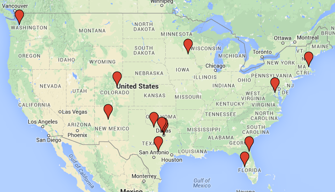
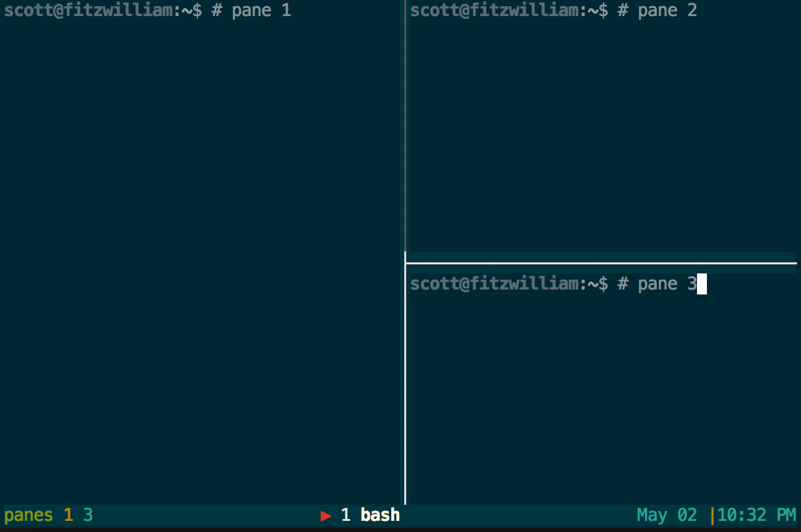
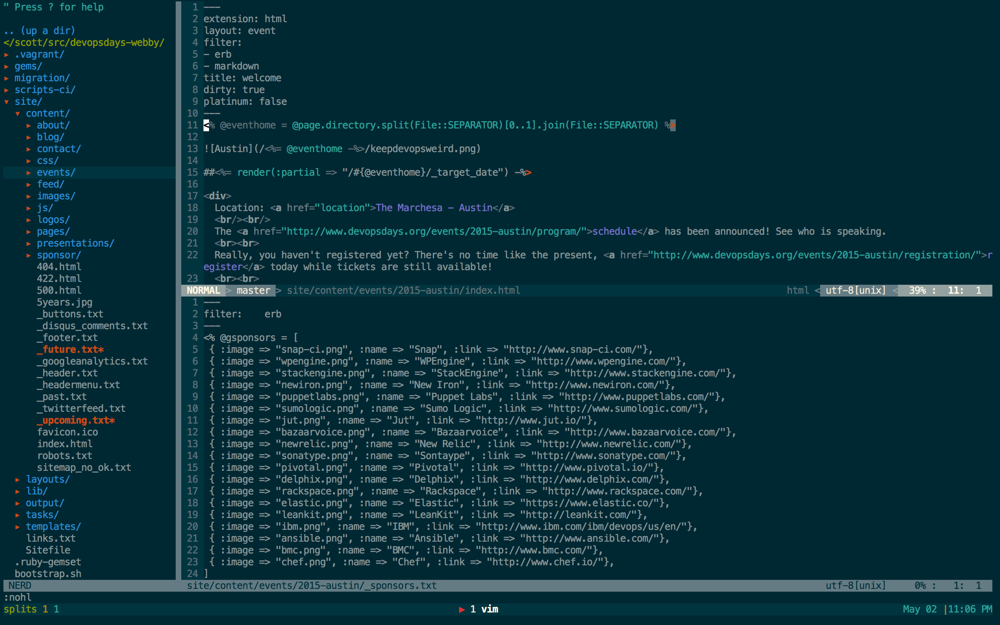
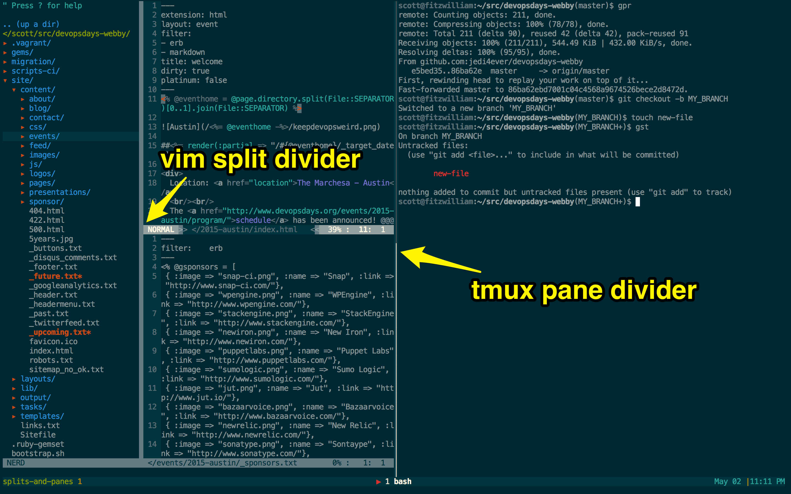
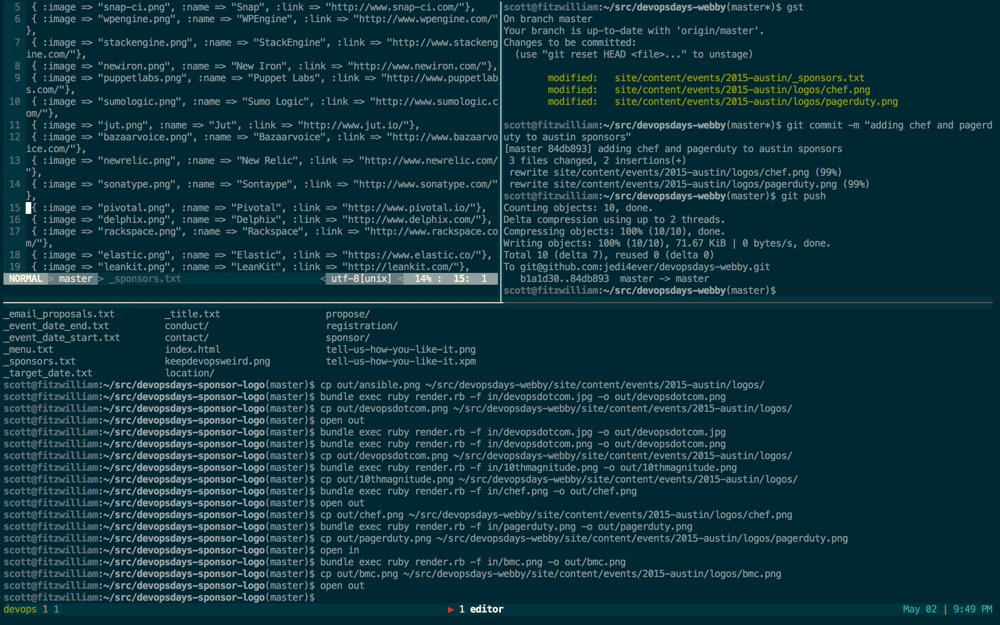
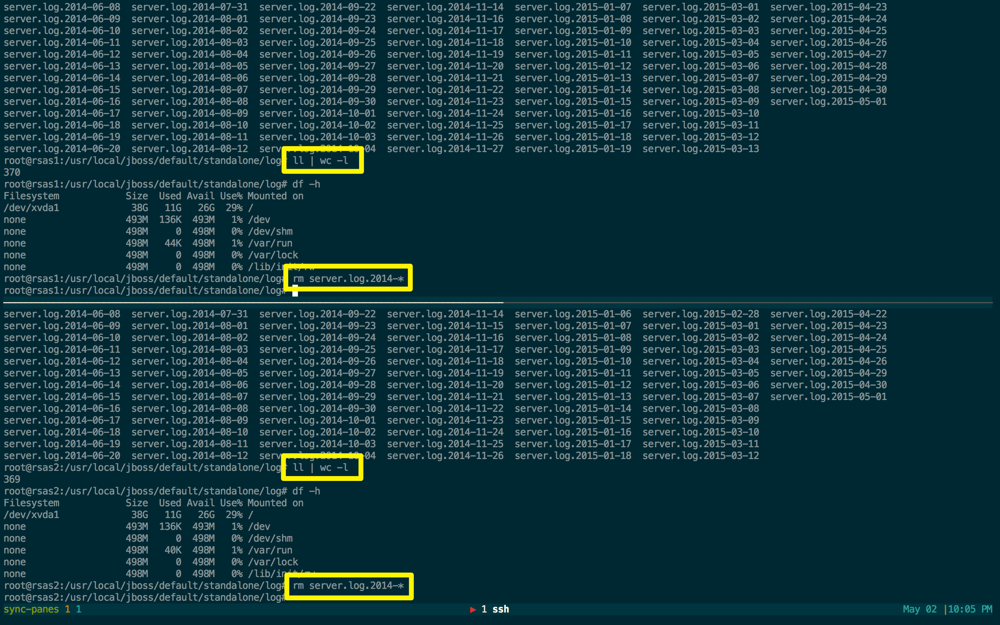

# Pairing with tmux and vim
## Realtime Tools<br/>for Remote Teams
### Scott Baldwin
#### Chief Happiness Officer, WellMatch
#### @scottsbaldwin

---

## We are NOT in the same room



- Instant Messaging: HipChat
- A/V: Skype
- Workstation: EC2
- ChatOps: lita
- Text Editor: vim
- Realtime Enabler: tmux

---

## Pair Programming

- distribute knowledge
- build quality up front
- mentoring
- can be taxing
- can be awkward
- shows your vulnerabilities
- requires humility

---


### [fit] **__Positivity + Eye Contact =__**
# [fit] Biobehavioral synchrony

_When positive emotions are shared_
_and **two** people make eye contact,_
_they move to the same hidden beat_
_and start to act as **one**._


---

## tmux

- create and attach to terminal sessions
- sessions can keep running in the background
- don't worry about "Write failed: Broken pipe"

---

# carve up your terminal<br/>into panes



---

## ~/.tmux.conf

```
# setw: set-window-option
# -g: sets the global session
setw -g mode-keys vi
bind | split-window -h
bind - split-window -v

# vim direction keys for pane switching
bind h select-pane -L
bind j select-pane -D
bind k select-pane -U
bind l select-pane -R

# maximize a pane
unbind Up; bind Up resize-pane -Z;
unbind Down; bind Zoom resize-pane -Z;

```

---

## vim

- terminal-based text editor
- sure, you could use emacs
- extensible with plugins to provide more power
- try to learn a new editor trick each week

---

# carve up your vim<br/>into splits



---



---

## I use it for devopsdays.org



---

## Synchronized panes in tmux

`:setw synchronized-panes on`



---

## tmuxinator

- quickly start up all your tmux panes
- launch commands within each pane

```
windows:
  - editor:
      layout: main-vertical
      panes:
        - vim
        - guard
  - server: bundle exec rails s
  - logs: tail -f log/development.log
```

---

## How we code remotely

- provision pairing instance
- checkout a feature branch
- pair programming
- acceptance of feature
- merge to master
- tear down pairing instance

---

## I <3 chatops

**"data" is our ChatOps bot**

```
bot pair me
bot pair add scottsbaldwin to quivering-cactus-4911
bot pair add <another user> to quivering-cactus-4911
bot pair stop quivering-cactus-4911
bot pair start quivering-cactus-4911
ssh scottsbaldwin@quivering-cactus-4911
sudo su devuser
tmux new -s my_session
```

---

## Driver/navigator


- set a timer, change roles
- person 1: dictates
- person 2: types

---

## Ping pong


- person 1: write failing test
- person 2: make test pass


---

## The Gondola


- I am a gondolier
- team members take a ride
- tmux provides a _gondola_
- riders enjoy the views


---

## Lessons I have Learned

- pairing is hard
- personal growth:
  - patience
  - listening
  - communicating
  - my way isn't always right
- it's kind of like marriage!

---

#[fit]Happy Pairing!


### @scottsbaldwin
#### Chief Happiness Officer, WellMatch